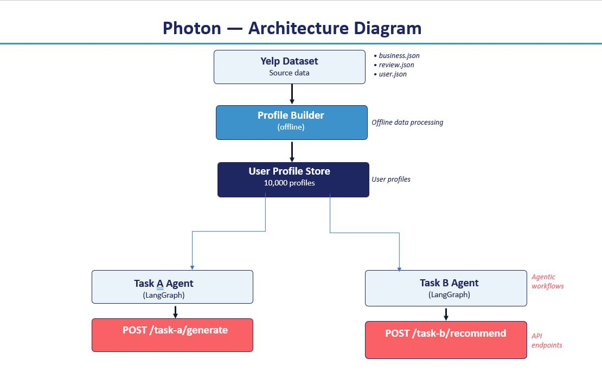
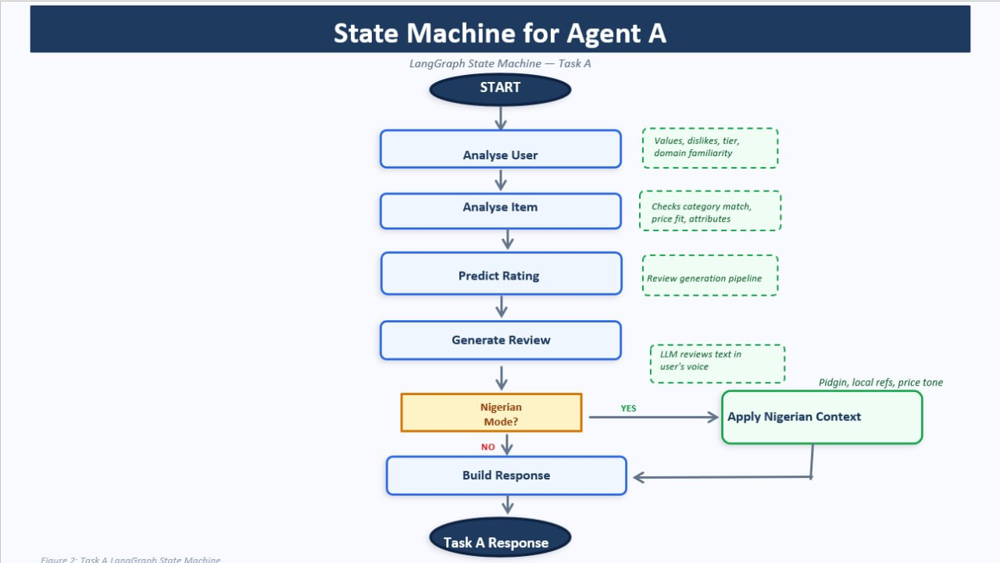
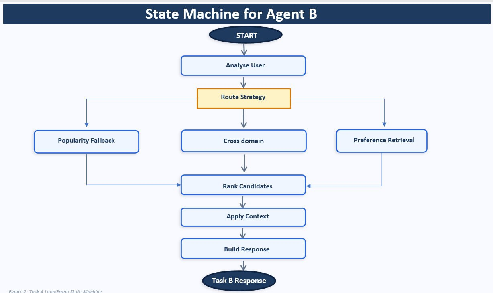

# BCT Hack LLM Agent Challenge



A two-task LLM agent system that models users behaviourally and delivers
personalised recommendations, built on the Yelp Academic Dataset.

**Task A:** given a user and an item, simulate the review and star rating
that user would write, in their authentic voice.

**Task B:** given a user, return a ranked list of personalised
recommendations with explanations grounded in their preferences.

Built with FastAPI, LangGraph, Groq, and BM25 retrieval. Containerised
with Docker.

> Submission for the DSN x Bluechip Tech LLM Agent Challenge, May 2026.

## Architecture


## Agent State Machines

**Task A: Review Generation Pipeline**



**Task B: Recommendation Pipeline**



## Quick start

### Prerequisites

- Docker and Docker Compose
- A Groq API key (free at [console.groq.com](https://console.groq.com))

### Run with Docker

```bash
git clone https://github.com/oladimeji-balogun/bluechip-hackathon-backend.git
cd bluechip-hackathon-backend
cp .env.example .env
# Add your GROQ_API_KEY to .env
docker-compose up --build
```

The API will be live at `http://localhost:8000`.
Interactive docs at `http://localhost:8000/docs`.

### Run locally

```bash
python -m venv venv && source venv/bin/activate
pip install -r requirements.txt
uvicorn main:app --reload
```


## Project structure

```
bluechip-hackathon-backend/
├── main.py                          # FastAPI entry point
├── src/
│   ├── config.py                    # settings and environment variables
│   ├── schemas/
│   │   └── user_profile.py          # all Pydantic models
│   ├── agents/
│   │   ├── A/                       # Task A LangGraph agent
│   │   │   ├── state.py             # TypedDict state definition
│   │   │   ├── nodes.py             # agent nodes (TaskAAgent class)
│   │   │   └── graph.py             # graph assembly and compilation
│   │   └── B/                       # Task B LangGraph agent
│   │       ├── state.py
│   │       ├── nodes.py             # agent nodes (AgentB class)
│   │       └── graph.py
│   ├── prompts/                     # Jinja2 Markdown prompt templates
│   │   ├── loader.py
│   │   ├── task_a_rating.md
│   │   ├── task_a_review.md
│   │   ├── task_b_analyze.md
│   │   ├── task_b_ranking.md
│   │   └── task_b_apply_context.md
│   ├── services/
│   │   ├── profile_builder.py       # Yelp data to UserProfile pipeline
│   │   └── catalogue.py             # BM25 business catalogue
│   ├── api/
│   │   ├── task_a.py                # Task A route handler
│   │   └── task_b.py                # Task B route handler
│   └── core/
│       └── profile_store.py         # in-memory profile lookup
├── scripts/
│   ├── build_catalogue.py           # builds BM25 business index
│   ├── evaluate_task_a.py           # ROUGE, BERTScore, RMSE evaluation
│   └── evaluate_task_b.py           # NDCG, Hit Rate evaluation
├── data/
│   ├── raw/                         # Yelp JSON files (not committed)
│   └── processed/                   # built profiles and catalogue
├── Dockerfile
├── docker-compose.yml
├── requirements.txt
└── .env.example
```


## Endpoints

### Task A: generate a review

```
POST /api/v1/task-a/generate
```

```json
{
  "user_id": "MGPQVLsODMm9ZtYQW-g_OA",
  "nigerian_mode": false,
  "item": {
    "item_id": "biz_001",
    "name": "The Melting Pot",
    "category": "Restaurants",
    "subcategories": ["Fondue", "Fine Dining"],
    "avg_community_rating": 4.1,
    "description": "Upscale fondue restaurant, great for special occasions.",
    "price_range": "$$$"
  }
}
```

Response:

```json
{
  "predicted_stars": 4.8,
  "predicted_stars_rounded": 5,
  "generated_review": "I recently had the pleasure of dining at The Melting Pot...",
  "confidence": 1.0,
  "reasoning": "Given the user's love for fine dining and generous rating tendency..."
}
```

### Task B: get recommendations

```
POST /api/v1/task-b/recommend
```

```json
{
  "user_id": "MGPQVLsODMm9ZtYQW-g_OA",
  "domain": "restaurants",
  "context": "Looking for somewhere to eat on a Friday evening",
  "top_k": 10,
  "nigerian_mode": false,
  "conversation_history": []
}
```

Response:

```json
{
  "recommendations": [
    {
      "rank": 1,
      "item_id": "YdpDpp130fxiX2DUdQLSqg",
      "item_name": "Bardea Food & Drink",
      "category": "Bars",
      "predicted_rating": 4.8,
      "relevance_score": 0.95,
      "explanation": "Matches your preference for unique dining experiences...",
      "nigerian_relevance_note": null
    }
  ],
  "reasoning": "Ranked based on user's preference for quality and atmosphere...",
  "cold_start_used": false,
  "cross_domain_used": false
}
```

Both endpoints accept either a `user_id` for profile store lookup, or a
full inline `user_profile` object for testing without pre-built profiles.

### Health check

Returns profile store status and business catalogue status.


## Data pipeline

The system requires two offline build steps before the server can run.

### 1. Build user profiles

Download the Yelp Academic Dataset from [yelp.com/dataset](https://www.yelp.com/dataset)
and place the JSON files in `data/raw/`.

```bash
python -m src.services.profile_builder
```

This scans the full review file to match every user with their complete
review history, then builds a `UserProfile` for each user capturing
rating behaviour, writing style, category preferences, and Nigerian
cultural context. Output is written to `data/processed/user_profiles.json`.

Default limit is 10,000 users. Remove the `limit` argument in the
`__main__` block for a full dataset run.

### 2. Build the business catalogue

```bash
python -m scripts.build_catalogue
```

Filters Yelp businesses to open listings with at least 10 reviews and
builds a BM25 index over name, categories, and city. Output is written
to `data/processed/business_catalogue.json`.

### Dataset stats

| Resource | Count |
|---|---|
| User profiles | 10,000 |
| Power users (100+ reviews) | 780 |
| Businesses in catalogue | 78,982 |
| BM25 indexed fields | name, categories, city |


## Evaluation

### Task A

```bash
python -m scripts.evaluate_task_a --samples 50
```

Uses a leave-one-out protocol: for each sampled user, held-out reviews
not in their profile history are identified, the most recent is used as
ground truth, and the agent generates a review for that same item.

| Metric | Score |
|---|---|
| ROUGE-1 | 0.3068 |
| ROUGE-2 | 0.0418 |
| ROUGE-L | 0.1495 |
| BERTScore F1 | 0.8364 |
| Rating RMSE | 1.1187 |
| Rating MAE | 0.8521 |
| Samples | 48 |

BERTScore F1 of 0.836 indicates strong semantic alignment between
generated and real reviews. Rating RMSE of 1.119 is a meaningful
improvement over a random baseline (estimated at 1.8 over the 1-5
star range).

### Task B

```bash
python -m scripts.evaluate_task_b --samples 20
```

Uses a leave-one-out protocol over held-out high-rated items (4+ stars).
Standard ranking metrics (NDCG@10, Hit Rate@10) are computed on name
matching between recommended items and held-out ground truth.

Note: due to Groq free tier rate limits, add a delay between requests
when running at scale. The script includes a built-in delay configurable
via `asyncio.sleep`.

## Team

| Name | Role |
|---|---|
| Oladimeji Balogun | Team lead, architecture, Task A agent, solution paper |
| Timothy Ayelagbe | Task B recommendation agent |
| Glory Bagai | Data engineering, profile builder pipeline |
| Promise Akinlua | FastAPI, Docker, repository |

Built for the DSN x Bluechip Tech LLM Agent Challenge, May 2026.


## Acknowledgements

- [Yelp Academic Dataset](https://www.yelp.com/dataset) : user, review,
  and business data used under the Yelp Dataset Terms of Use for academic
  purposes only. Raw data files are not committed to this repository.
- [Groq](https://groq.com) : LLM inference via Llama 3.3 70B and
  Llama 3.1 8B
- [LangGraph](https://langchain-ai.github.io/langgraph/) : agentic
  workflow orchestration
- [rank-bm25](https://github.com/dorianbrown/rank_bm25) : BM25 retrieval

## Licence

This codebase is submitted as part of the DSN x Bluechip Tech LLM Agent
Challenge. All rights reserved.